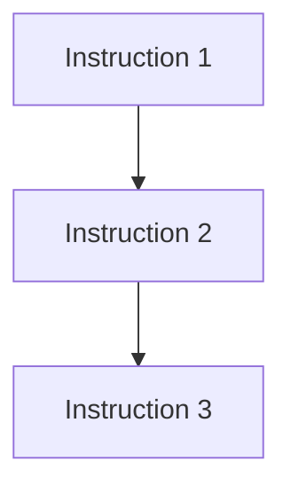

# Extract and Organize Instructions from Conversation History

## Task
Analyze the entire conversation history to extract all instructions, requests, and tasks from the user, then organize them systematically. Output the results to a file and provide the file path.

## Output Format
### 1. Instruction List
List each instruction chronologically:
- **[Timestamp/Order]** Instruction content (summary of original)
  - Purpose: What the instruction is for
  - Status: Completed/In Progress/Not Started

### 2. Categorized Organization
Classify instructions by the following aspects:
- **Main Tasks**: Primary work instructions
- **Sub-tasks**: Associated detailed instructions
- **Constraints**: Rules and conditions to follow
- **Output Requirements**: Format specifications

### 3. Dependency Map

### 4. Implementation Summary
- **Completed Items**: What has been done
- **Remaining Items**: What needs to be done
- **Blocked Items**: What cannot proceed and why

## Execution Process
1. Read entire conversation history
2. Extract all user instructions
3. Analyze relationships and dependencies
4. Generate organized summary
5. Save to file (path: CLAUDE/summaries/YYYY-MM-DD_HH-mm-ss_summary.md)
6. Return file path to user

## Notes
- Include both explicit and implicit instructions
- Note any changes or updates to original instructions
- Highlight critical requirements and constraints
- Identify potential conflicts or ambiguities

## Output Language
- The summary file should be written in Japanese
- Use clear and professional Japanese language
- Technical terms can remain in English where appropriate